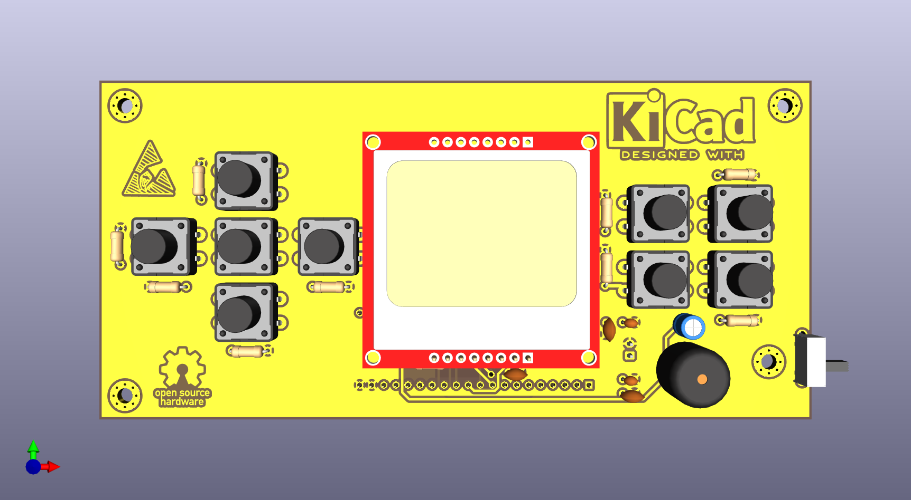
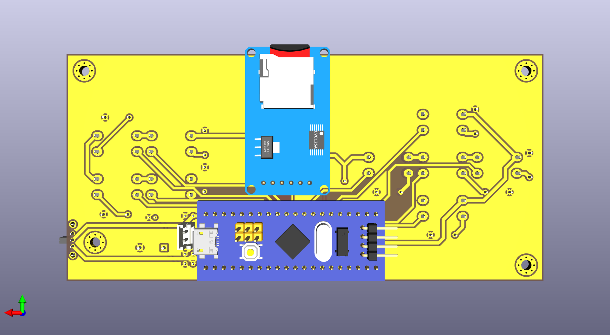

# Videogame Portátil com STM32F103 (Blue Pill)

## Sumário
- [1. Introdução](#1-introdução)
- [2. Objetivos do Projeto](#2-objetivos-do-projeto)
  - [2.1 Objetivo Geral](#21-objetivo-geral)
  - [2.2 Objetivos Específicos](#22-objetivos-específicos)
- [3. Visão Geral do Sistema](#3-visão-geral-do-sistema)
  - [3.1 Arquitetura Geral](#31-arquitetura-geral)
  - [3.2 Fluxo Geral de Operação](#32-fluxo-geral-de-operação)
- [4. Escolha dos Componentes](#4-escolha-dos-componentes)
  - [4.1 Microcontrolador – STM32F103C8T6 (Blue Pill)](#41-microcontrolador--stm32f103c8t6-blue-pill)
  - [4.2 Display – Nokia 5110 (PCD8544)](#42-display--nokia-5110-pcd8544)
  - [4.3 Armazenamento – Cartão SD (Modo SPI)](#43-armazenamento--cartão-sd-modo-spi)
  - [4.4 Interface de Entrada – Botões Táteis](#44-interface-de-entrada--botões-táteis)
  - [4.5 Áudio – Buzzer Passivo](#45-áudio--buzzer-passivo)
- [5. Projeto do Esquemático](#5-projeto-do-esquemático)
  - [5.1 Circuito de Alimentação](#51-circuito-de-alimentação)
  - [5.2 Desacoplamento do Microcontrolador e Periféricos](#52-desacoplamento-do-microcontrolador-e-periféricos)
  - [5.3 Comunicação SPI](#53-comunicação-spi)
  - [5.4 Interface com o Display](#54-interface-com-o-display)
  - [5.5 Interface com o Cartão SD](#55-interface-com-o-cartão-sd)
  - [5.6 Interface de Entrada (Botões)](#56-interface-de-entrada-botões)
  - [5.7 Circuito de Áudio](#57-circuito-de-áudio)
- [6. Definição de Pinout](#6-definição-de-pinout)
  - [6.1 Tabela de Pinout](#61-tabela-de-pinout)
  - [6.2 Justificativa do Pinout](#62-justificativa-do-pinout)
- [7. Projeto da PCB](#7-projeto-da-pcb)
  - [7.1 Considerações Gerais](#71-considerações-gerais)
  - [7.2 Primeira Versão da PCB](#72-primeira-versão-da-pcb)
  - [7.3 Segunda Versão da PCB](#73-segunda-versão-da-pcb)
  - [7.4 Análise do Layout Final](#74-análise-do-layout-final)
- [8. Visualização 3D e Montagem](#8-visualização-3d-e-montagem)
  - [8.1 Modelo 3D da PCB](#81-modelo-3d-da-pcb)
  - [8.2 Considerações de Montagem](#82-considerações-de-montagem)
- [9. Conclusão](#9-conclusão)
- [10. Referências](#10-referências)

---

## 1. Introdução
Este documento apresenta a **documentação técnica do hardware** de um videogame portátil desenvolvido com foco educacional e experimental, baseado no microcontrolador **STM32F103C8T6 (Blue Pill)**. O objetivo principal desta documentação é **descrever, justificar e analisar as decisões de projeto de hardware**, desde a escolha dos componentes até o esquemático elétrico e o layout final da PCB.

O projeto foi concebido para integrar conceitos de eletrônica digital, sistemas embarcados e boas práticas de projeto de placas de circuito impresso, priorizando simplicidade, modularidade e confiabilidade elétrica. Questões relacionadas a firmware são abordadas apenas quando necessárias para justificar decisões de hardware.

---

## 2. Objetivos do Projeto

### 2.1 Objetivo Geral
Desenvolver e documentar o **hardware de um videogame portátil**, incluindo esquemático elétrico e PCB, utilizando componentes amplamente disponíveis e de baixo custo, garantindo funcionamento estável e possibilidade de expansão futura.

### 2.2 Objetivos Específicos
- Selecionar um microcontrolador adequado para aplicações gráficas simples e controle de periféricos  
- Projetar um circuito de alimentação estável em 3,3 V  
- Implementar comunicação SPI confiável para display gráfico e cartão SD  
- Desenvolver uma interface física com botões e sinalização sonora  
- Aplicar boas práticas de desacoplamento, filtragem e layout de PCB  

---

## 3. Visão Geral do Sistema

### 3.1 Arquitetura Geral
O sistema é composto pelos seguintes blocos funcionais:
- Unidade de processamento baseada no STM32F103  
- Interface de usuário composta por display gráfico, botões e buzzer  
- Sistema de armazenamento removível via cartão SD  
- Circuito de alimentação em 3,3 V  

### 3.2 Fluxo Geral de Operação
1. Energização do circuito e estabilização da alimentação  
2. Inicialização do microcontrolador  
3. Configuração dos periféricos SPI  
4. Leitura das entradas do usuário  
5. Atualização do display e geração de áudio  

---

## 4. Escolha dos Componentes

### 4.1 Microcontrolador – STM32F103C8T6 (Blue Pill)

 <figure align="center">
  
 
    
    
  

</figure> 

  <figcaption>
    <b>Figura 1</b> – Microcontrolador STM32F103C8T6 e sua Dev Board (Blue Pill)
  </figcaption>

 

O STM32F103C8T6 foi escolhido por oferecer um equilíbrio adequado entre desempenho, custo e disponibilidade. O núcleo ARM Cortex-M3 operando a até 72 MHz é suficiente para aplicações gráficas simples, leitura de entradas e controle de periféricos.

A utilização do módulo Blue Pill reduz a complexidade do projeto, facilita testes e depuração e permite foco no desenvolvimento do restante do hardware.

## Visão Geral

A família **STM32F103xx de média densidade da linha performance** incorpora o núcleo **Arm® Cortex®-M3 de 32 bits**, de alto desempenho, operando a uma frequência de até **72 MHz**, memórias embarcadas de alta velocidade (**Flash de até 128 Kbytes** e **SRAM de até 20 Kbytes**), além de uma ampla variedade de **E/S aprimoradas** e **periféricos** conectados a dois barramentos **APB**.

Todos os dispositivos oferecem **dois ADCs de 12 bits**, **três temporizadores de uso geral de 16 bits** mais **um temporizador PWM**, bem como interfaces de comunicação padrão e avançadas: até **dois I2Cs e SPIs**, **três USARTs**, **USB** e **CAN**.

Os dispositivos operam com alimentação de **2,0 a 3,6 V**. Estão disponíveis tanto na faixa de temperatura de **–40 a +85 °C** quanto na faixa estendida de **–40 a +105 °C**. Um conjunto abrangente de **modos de economia de energia** permite o projeto de aplicações de baixo consumo.

A família STM32F103xx de média densidade inclui dispositivos em **seis tipos diferentes de encapsulamento**, variando de **36 pinos a 100 pinos**. Dependendo do dispositivo escolhido, diferentes conjuntos de periféricos são incluídos. A descrição a seguir fornece uma visão geral da gama completa de periféricos oferecidos por esta família.

Essas características tornam a família de microcontroladores STM32F103xx de média densidade adequada para uma ampla gama de aplicações, como **acionamento de motores**, **controle de aplicações**, **equipamentos médicos e portáteis**, **periféricos para PC e jogos**, **plataformas GPS**, **aplicações industriais**, **CLPs**, **inversores**, **impressoras**, **scanners**, **sistemas de alarme**, **interfones de vídeo** e **sistemas HVAC**.

---

## Características

### Núcleo
- Núcleo **Arm® Cortex®-M3 de 32 bits**
- Frequência máxima de **72 MHz**
- Desempenho de **1,25 DMIPS/MHz** (Dhrystone 2.1) com acesso à memória sem wait states
- Multiplicação em ciclo único e divisão por hardware

### Memórias
- **64 ou 128 Kbytes** de memória Flash
- **20 Kbytes** de SRAM

### Gerenciamento de clock, reset e alimentação
- Alimentação da aplicação e E/S de **2,0 a 3,6 V**
- **POR**, **PDR** e detector de tensão programável (**PVD**)
- Oscilador a cristal de **4 a 16 MHz**
- Oscilador RC interno de **8 MHz** calibrado em fábrica
- Oscilador RC interno de **40 kHz**
- **PLL** para clock da CPU
- Oscilador de **32 kHz** para RTC com calibração

### Baixo consumo
- Modos **Sleep**, **Stop** e **Standby**
- Alimentação **VBAT** para RTC e registradores de backup

### Conversores A/D
- **2 conversores A/D de 12 bits**, **1 µs** (até **16 canais**)
- Faixa de conversão: **0 a 3,6 V**
- Capacidade de **dupla amostragem e retenção**
- **Sensor de temperatura** interno

### DMA
- Controlador DMA de **7 canais**
- Periféricos suportados: temporizadores, ADC, SPI, I2C e USART

### Portas de E/S
- Até **80 portas de E/S rápidas**
- **26 / 37 / 51 / 80 E/S**, todas mapeáveis em **16 vetores de interrupção externa** e quase todas **tolerantes a 5 V**

### Depuração
- Interfaces de depuração **Serial Wire Debug (SWD)** e **JTAG**

### Temporizadores
- **Três temporizadores de 16 bits**, cada um com até 4 canais IC/OC/PWM ou contador de pulsos e entrada de encoder incremental (quadratura)
- Temporizador PWM de **16 bits para controle de motores**, com geração de dead-time e parada de emergência
- **Dois watchdogs** (independente e de janela)
- Temporizador **SysTick** de 24 bits (contador regressivo)

### Interfaces de comunicação
- Até **nove interfaces de comunicação**
- Até **duas interfaces I2C** (SMBus/PMBus®)
- Até **três USARTs** (interface ISO 7816, LIN, capacidade IrDA, controle de modem)
- Até **duas interfaces SPI** (até **18 Mbit/s**)
- Interface **CAN 2.0B Active**
- Interface **USB 2.0 Full-Speed**

### Outros recursos
- Unidade de cálculo **CRC**
- **ID único de 96 bits**
- Encapsulamentos **ECOPACK®**

### 4.2 Display – Nokia 5110 (PCD8544)

 

  <figure>
      
  </figure> 

 

  <figcaption>
    <b>Figura 2</b> – Display LCD Nokia 5110
  </figcaption>

 

O display Nokia 5110 foi selecionado por sua simplicidade de interface, baixo consumo de energia e ampla documentação disponível. Sua resolução de 84x48 pixels é adequada para jogos 2D simples e menus gráficos.

### 4.3 Armazenamento – Cartão SD (Modo SPI)

 

  <figure>
      
  </figure> 

 

  <figcaption>
    <b>Figura 3</b> – Módulo Micro Cartão SD
  </figcaption>

 

O cartão SD operando em modo SPI oferece alta capacidade de armazenamento com baixa complexidade de hardware. Ele é utilizado para armazenamento de dados persistentes como estados de jogos e configurações.

### 4.4 Interface de Entrada – Botões Táteis
Os botões táteis foram escolhidos por sua robustez, simplicidade elétrica e fácil integração com GPIOs do microcontrolador. O tratamento de debounce é realizado via software.

### 4.5 Áudio – Buzzer Passivo
O buzzer passivo permite geração de áudio por PWM, utilizando timers internos do STM32. Essa abordagem oferece flexibilidade sonora com baixo custo e simplicidade de hardware.

---

## 5. Projeto do Esquemático

O esquemático elétrico do videogame portátil foi desenvolvido com foco em simplicidade, robustez elétrica e boas práticas de projeto para sistemas embarcados. A organização do circuito segue uma divisão funcional clara, permitindo fácil compreensão, manutenção e futuras modificações.

<figure align="center">
  
  <figcaption>
    <b>Figura 4</b> – Esquemático elétrico versão v1
  </figcaption>
</figure>

 

  <a href="hardware/ProtoGame/ProtoGame-jobset-file/ProtoGame-schematic-v1/ProtoGame.pdf">Esquemático elétrico completo (PDF)</a>

 

---

### 5.1 Circuito de Alimentação

O sistema foi projetado para operar integralmente em **3,3 V**, tensão compatível com o microcontrolador STM32F103C8T6 e com todos os periféricos utilizados. A alimentação principal é fornecida por uma bateria, cuja tensão é regulada por um regulador linear **AMS1117-3.3**.

O regulador AMS1117 foi escolhido por sua ampla disponibilidade e facilidade de aplicação, sendo adequado para projetos educacionais e protótipos funcionais. Apesar de sua eficiência inferior quando comparado a reguladores chaveados, seu uso é justificado pelo consumo moderado do sistema e pela simplicidade do circuito.

Na entrada e na saída do regulador são utilizados capacitores de filtragem, conforme recomendado pelo fabricante, garantindo estabilidade da tensão e evitando oscilações indesejadas.

---

### 5.2 Capacitores Bulk e Filtragem de Baixa Frequência

O capacitor **bulk** de maior valor (47 µF) foi inserido na linha de alimentação principal com o objetivo de absorver variações lentas de corrente e fornecer energia instantânea durante picos de consumo, especialmente durante inicialização do sistema e acesso ao cartão SD.

Além do capacitor bulk principal, capacitores adicionais de **4,7 µF** são distribuídos próximos a blocos específicos do circuito, atuando como suporte local de energia. Essa abordagem reduz quedas momentâneas de tensão e melhora a estabilidade global da alimentação.

O uso combinado de capacitores de diferentes valores cria um efeito de filtragem em larga faixa de frequência, aumentando a confiabilidade do sistema.

---

### 5.3 Desacoplamento do Microcontrolador e Periféricos

Cada circuito integrado presente no projeto possui capacitores cerâmicos de **100 nF** posicionados o mais próximo possível de seus pinos de alimentação. Esses capacitores atuam como desacoplamento de alta frequência, reduzindo ruídos gerados por comutações internas e interferências no barramento de alimentação.

O microcontrolador STM32F103C8T6 possui múltiplos pinos de alimentação (VDD e VDDA), sendo essencial o desacoplamento individual de cada domínio. O domínio analógico (VDDA) recebe atenção especial, garantindo menor interferência em funções sensíveis internas do microcontrolador.

Essa prática evita resets espúrios, falhas de comunicação SPI e comportamentos instáveis durante operação contínua.

---

### 5.4 Comunicação SPI

A comunicação SPI é utilizada para interface com o display gráfico Nokia 5110 e com o módulo de cartão SD. Ambos os dispositivos compartilham as linhas de clock (SCK) e dados (MOSI e MISO), utilizando sinais de **Chip Select independentes** para controle de acesso.

Foram adicionados resistores em série nas linhas de clock e dados, próximos ao microcontrolador, com a finalidade de reduzir efeitos de ringing, overshoot e reflexões em trilhas mais longas. Essa técnica melhora significativamente a integridade do sinal, especialmente no acesso ao cartão SD, que é mais sensível a ruídos.

Resistores de pull-up nos sinais de Chip Select garantem que os dispositivos permaneçam desabilitados durante a inicialização do sistema.

---

### 5.5 Interface com o Display LCD

O display Nokia 5110 utiliza o barramento SPI para comunicação de dados e comandos, além de sinais adicionais de controle como **Reset** e **Data/Command**. Esses sinais são controlados diretamente por GPIOs do microcontrolador.

A alimentação do display é feita em 3,3 V, eliminando a necessidade de conversores de nível lógico. O controle do backlight é realizado por meio de um pino dedicado, permitindo economia de energia quando o display não está em uso.

A escolha desse display contribui para um circuito simples, de baixo consumo e fácil integração.

---

### 5.6 Interface com o Cartão SD

O cartão SD é operado em **modo SPI**, reduzindo significativamente a complexidade do hardware quando comparado ao modo SD nativo. Essa abordagem é suficiente para leitura e escrita de dados de pequeno volume, como estados de jogos e configurações.

Capacitores de desacoplamento dedicados são utilizados próximos ao módulo SD, devido aos picos de corrente característicos durante operações de escrita. Essa decisão é fundamental para evitar falhas intermitentes de comunicação.

---

### 5.7 Interface de Entrada – Botões

Os botões táteis são conectados diretamente aos pinos GPIO do microcontrolador, utilizando resistores de polarização de **10 kΩ** para garantir níveis lógicos definidos quando não acionados. Essa configuração evita estados flutuantes e simplifica o circuito.

O tratamento de debounce é realizado via software, reduzindo a quantidade de componentes externos e mantendo o esquemático mais enxuto.

---

### 5.8 Circuito de Áudio

O circuito de áudio é composto por um buzzer passivo acionado por um pino de timer do STM32F103, permitindo geração de sinais PWM em diferentes frequências. Essa abordagem possibilita a criação de efeitos sonoros simples, adequados para um videogame portátil.

A escolha do buzzer passivo oferece maior flexibilidade sonora em comparação a buzzers ativos, mantendo baixo custo e simplicidade de implementação.

---

## 6. Bill of Materials (BoM)

A Bill of Materials apresenta todos os componentes utilizados no projeto, sendo essencial para reprodução do hardware, aquisição de peças e validação do circuito.

**Tabela 2** – Bill of Materials (BoM).

| Referência | Qtd | Valor / Modelo | Função |
|:----------|:---:|----------------|--------|
| BT1 | 1 | Battery | Alimentação do sistema |
| BZ1 | 1 | Buzzer | Saída de áudio |
| C1–C2, C4–C6, C9 | 6 | 100 nF | Desacoplamento |
| C3 | 1 | 47 µF | Capacitor bulk |
| C7–C8 | 2 | 4.7 µF | Filtragem local |
| J1 | 1 | SD Card Module | Armazenamento |
| LCD_Nokia1 | 1 | Nokia 5110 | Display gráfico |
| R1–R11 | 11 | 10 kΩ | Pull-up / Pull-down |
| SW1 | 1 | SW_DPST_x2 | Chave geral |
| SW2–SW10 | 9 | SW_MEC_5E | Botões |
| U1 | 1 | STM32F103C8T6 | Microcontrolador |
| U2 | 1 | AMS1117-3.3 | Regulador 3,3 V |

---

## 6. Definição de Pinout

 

  <figure>
      
  </figure> 

 

  <figcaption>
    <b>Figura 5</b> – IOC MCU Pinout
  </figcaption>

 

### 6.1 Tabela de Pinout

 

**Tabela 1** – Mapeamento de pinos do STM32F103C8T6.
  
| Pino | Nome (MCU) | Função |
|:-----:|:------------:|:--------|
| 1 | VBAT | Alimentação de bateria |
| 5 | PD0 | Cristal externo (OSC_IN) |
| 6 | PD1 | Cristal externo (OSC_OUT) |
| 7 | NRST | Reset |
| 10 | PA0 | Reset do LCD |
| 11 | PA1 | LCD Data/Command |
| 13 | PA3 | CS do LCD |
| 14 | PA4 | CS do Cartão SD |
| 15 | PA5 | SPI1 SCK |
| 16 | PA6 | SPI1 MISO |
| 17 | PA7 | SPI1 MOSI |
| 18 | PB0 | Backlight do LCD |
| 29 | PA8 | Buzzer |
| 30–42 | PA9–PB6 | Botões |
| 34 | PA13 | SWDIO |
| 37 | PA14 | SWCLK |
| 44 | BOOT0 | Seleção de boot |

 

### 6.2 Justificativa do Pinout
O pinout foi definido priorizando o uso do SPI1, timers dedicados para PWM e pinos compatíveis com depuração SWD, garantindo organização e facilidade de manutenção.

---

## 7. Projeto da PCB

### 7.1 Considerações Iniciais e Restrições de Fabricação

O projeto da placa de circuito impresso (PCB) do videogame portátil foi desenvolvido considerando, desde o início, as **restrições reais de fabricação impostas pelo processo de fresagem CNC**, disponível no **Laboratório de Engenharia de Sistemas Computacionais (LESC) da Universidade Federal do Ceará (UFC)**.

Diferentemente de processos industriais convencionais (como fabricação química com máscara de solda e acabamento superficial), a fresagem CNC impõe limitações específicas, tais como:
- Ausência de máscara de solda  
- Trilhas e espaçamentos maiores  
- Vias de maior diâmetro  
- Cobre exposto (sem HASL ou ENIG)  

Essas restrições influenciaram diretamente as decisões de layout, regras de projeto e escolha de encapsulamentos, priorizando **robustez mecânica, confiabilidade elétrica e facilidade de montagem manual**.

### 7.2 Definição do Stackup da PCB

 <figure align="center">
  
 
    
    
  

</figure> 

  <figcaption>
    <b>Figura 6</b> – Camadas Top e Bottom da PCB
  </figcaption>

 

A placa foi projetada com **duas camadas condutoras (Top e Bottom)**, configuração que representa um compromisso adequado entre custo, complexidade e desempenho elétrico para a aplicação proposta.

A escolha por duas camadas foi motivada pelos seguintes fatores:
- Frequências de operação relativamente baixas (SPI e GPIO)  
- Ausência de circuitos analógicos sensíveis ou RF  
- Possibilidade de implementação de planos de referência contínuos  
- Compatibilidade com o processo de fabricação por CNC  

Essa configuração é suficiente para garantir bom retorno de corrente, roteamento organizado e estabilidade elétrica, sem a complexidade adicional de PCBs multicamadas.

### 7.3 Regras de Projeto e Parâmetros de Fabricação

As regras de projeto foram definidas explicitamente no KiCad, levando em consideração as capacidades da fresadora CNC disponível no laboratório.

As principais regras adotadas foram:
- **Largura mínima de trilha:** 0,5 mm  
- **Diâmetro mínimo de furo de via:** 0,9 mm  
- **Diâmetro do pad da via:** 1,5 mm  
- **Espaçamento entre trilhas:** padrão do KiCad  

Esses valores garantem:
- Boa taxa de sucesso na fabricação  
- Facilidade de soldagem manual  
- Redução de falhas por descontinuidade de trilhas  

A espessura da placa foi mantida como o **valor padrão do KiCad**, compatível com laminados FR4 comumente utilizados em ambientes acadêmicos.

### 7.4 Estratégia de Aterramento (GND)

O aterramento do sistema foi implementado por meio de **planos de GND contínuos em ambas as camadas da PCB**, cobrindo praticamente toda a área da placa.

Essa abordagem proporciona:
- Caminhos de retorno de corrente de baixa impedância  
- Redução de ruído eletromagnético  
- Maior estabilidade para o barramento SPI  
- Melhor comportamento do sistema de alimentação  

Não foram utilizadas **vias de costura (stitching vias)** dedicadas exclusivamente ao aterramento. Apenas vias funcionais foram empregadas, conectando o plano de GND entre as camadas quando necessário. Essa decisão simplificou o processo de fabricação e montagem, sendo considerada adequada para as frequências e correntes envolvidas no projeto.

### 7.5 Distribuição de Alimentação e Desacoplamento

Todo o sistema opera em **3,3 V**, tensão compatível com o microcontrolador STM32F103, o display gráfico e o cartão SD. A utilização de uma única tensão de alimentação reduz a complexidade do circuito e elimina a necessidade de conversores de nível lógico.

#### 7.5.1 Capacitores de Desacoplamento
Foram utilizados capacitores cerâmicos de **100 nF**, posicionados o mais próximo possível dos pinos de alimentação do microcontrolador e dos periféricos. Essa prática minimiza a indutância parasita e melhora a resposta a transientes de corrente.

#### 7.5.2 Capacitor Bulk
Um capacitor eletrolítico de **47 µF** foi posicionado próximo ao microcontrolador, atuando como capacitor de bulk para absorver variações mais lentas de corrente e estabilizar a tensão do barramento de alimentação.

#### 7.5.3 Alimentação do Cartão SD e do Display
Tanto o módulo de cartão SD quanto o display gráfico possuem **capacitores dedicados de desacoplamento**, além de estarem conectados ao barramento principal de 3,3 V. Essa decisão considera os picos de corrente característicos do cartão SD durante operações de leitura e escrita.

O dimensionamento dos capacitores seguiu valores amplamente utilizados em aplicações similares, sendo suficiente para garantir funcionamento estável, mesmo sem cálculo analítico detalhado.

### 7.6 Roteamento do Barramento SPI

O barramento SPI é utilizado para comunicação com o display gráfico e com o cartão SD. O roteamento foi realizado buscando:
- Trilhas relativamente curtas  
- Pouca utilização de vias  
- Organização vertical das conexões

 <figure align="center">
  
 
    
    
  

</figure> 

  <figcaption>
    <b>Figura 7</b> – Roteamento nas camadas Top e Bottom da PCB
  </figcaption>

 

 

Considerando as dimensões da placa, a maior distância entre dispositivos no barramento SPI é da ordem de **50 mm**, valor adequado para as frequências utilizadas no projeto.

No esquemático, foram previstos **resistores em série** nas linhas:
- SCK: 33 Ω  
- MOSI: 22 Ω  

Entretanto, esses resistores não foram implementados na versão final do layout da PCB. Por outro lado, foram utilizados **resistores de pull-up de 10 kΩ nas linhas de Chip Select**, garantindo que os dispositivos SPI permaneçam desabilitados durante a inicialização do sistema.

### 7.7 Clock do Microcontrolador

O projeto utiliza o **módulo Blue Pill**, que já incorpora um cristal externo (8 MHz ou 16 MHz, dependendo da versão), bem como os capacitores de carga necessários.

Essa escolha elimina a necessidade de roteamento de sinais de clock sensíveis na PCB principal, reduzindo riscos de ruído, erros de temporização e falhas de oscilação, além de simplificar o layout.

### 7.8 Considerações Mecânicas e Ergonomia

A disposição dos componentes na PCB levou em conta simultaneamente:
- **Ergonomia do usuário**  
- **Simetria visual**  
- **Facilidade de roteamento**  

Os botões foram posicionados de forma a permitir operação confortável com os polegares, enquanto o display foi centralizado mecanicamente, considerando sua espessura e o uso de espaçadores.

Foram utilizados **furos de montagem com diâmetro de 3,2 mm**, compatíveis com parafusos M3, permitindo a fixação segura da placa em um eventual gabinete.

### 7.9 Evolução do Projeto: PCB V0 para PCB V1

A transição da versão inicial da PCB (V0) para a versão revisada (V1) foi motivada por múltiplos fatores:
- Correção de erros elétricos  
- Ajustes mecânicos  
- Melhor distribuição dos componentes  
- Melhoria estética do conjunto  
- Facilidade de fabricação e montagem  

Durante esse processo, foi identificado um **erro dimensional em um footprint**, que resultava em interferência mecânica durante a montagem. Esse problema foi corrigido na versão V1, reforçando a importância de validações mecânicas e revisões iterativas no projeto de PCBs.

### 7.10 Limitações Assumidas do Layout

Algumas limitações foram conscientemente aceitas no projeto, tais como:
- Ausência de máscara de solda  
- Não utilização de vias de costura de GND  
- Resistores série do SPI não implementados no layout  

Essas decisões são justificadas pelo contexto acadêmico, pelas restrições de fabricação por CNC e pelos requisitos elétricos relativamente modestos do sistema.

---

## 8. Visualização 3D e Montagem

### 8.1 Modelo 3D da PCB
Modelos 3D foram gerados no KiCad para validação mecânica e visual.

 <figure align="center">
  
 
    
    
  

</figure> 

  <figcaption>
    <b>Figura 8</b> – Top e Bottom do Modelo 3D da PCB
  </figcaption>

 

 

### 8.2 Considerações de Montagem
O posicionamento dos componentes facilita acesso ao display, botões e cartão SD.

 <figure align="center">
  
 
    
    
  

</figure> 

  <figcaption>
    <b>Figura 7</b> – Top e Bottom da PCB
  </figcaption>

 

---

## 9. Conclusão
O projeto atinge os objetivos propostos, resultando em um hardware funcional, organizado e adequado para fins educacionais e experimentais.

---

## 10. Referências
- Datasheets: <a href="documentação/Datasheets">Datasheets consultados</a>  
- Application Notes da STMicroelectronics  
- KiCad Documentation  
